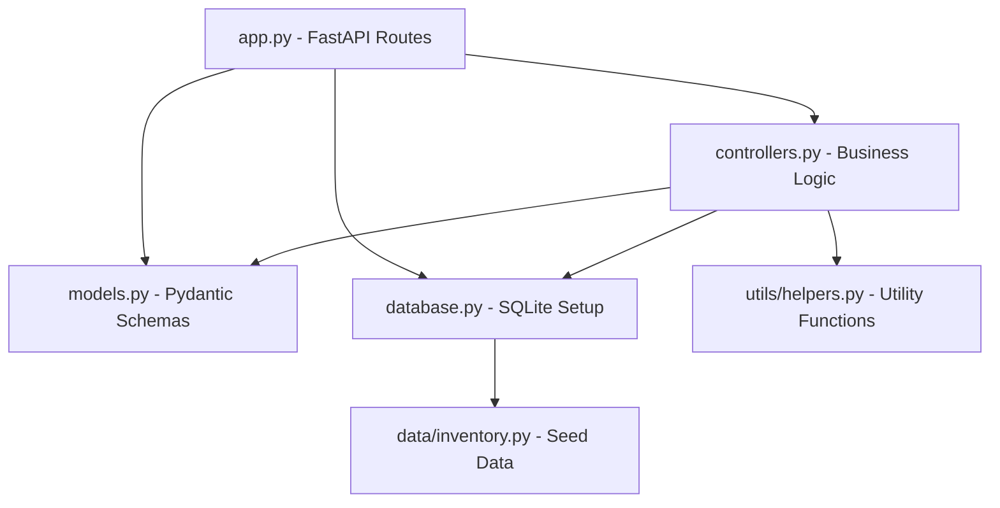

# Inventory Tracker

## Overview

A modular Python application that tracks inventory items and computes stock statistics.
Re-engineered in Lab 4 with FastAPI, SQLite, Pydantic, and Docker.

## Project Structure
```
inventoryTracker/
│
├── app.py              # FastAPI entry point - REST API routes
├── models.py           # Pydantic data models and schema validation
├── controllers.py      # Business logic layer - CRUD and statistics
├── database.py         # SQLite setup, connection, and data seeding
├── Dockerfile          # Container definition for the app
├── docker-compose.yml  # Container orchestration
├── requirements.txt    # Project dependencies
├── README.md           # Project documentation
├── .gitignore          # Files ignored by Git
│
├── data/
│   └── inventory.py    # Seed data (item_name, quantity, price)
│
└── utils/
    └── helpers.py      # Utility functions: highest/lowest stock, total value
```

## Module Dependency Diagram


## API Endpoints

| Method | Endpoint | Description |
|--------|----------|-------------|
| GET | / | Health check |
| GET | /items | List all inventory items |
| GET | /items/{id} | Get single item by ID |
| POST | /items | Add new inventory item |
| DELETE | /items/{id} | Delete item by ID |
| GET | /summary | Inventory statistics |

## How to Run

### Locally
```bash
# Install dependencies
pip install -r requirements.txt

# Run the application
uvicorn app:app --reload
```

### With Docker
```bash
docker compose up --build
```

Then visit: http://127.0.0.1:8000/docs

## Example API Response
```json
{
  "id": 1,
  "item_name": "Laptop",
  "quantity": 10,
  "price": 999.99,
  "value": 9999.90
}
```

## Example Summary Response
```json
{
  "highest_stock_item": "Mouse",
  "highest_quantity": 50,
  "lowest_stock_item": "USB Hub",
  "lowest_quantity": 0,
  "total_stock_value": 13024.35
}
```